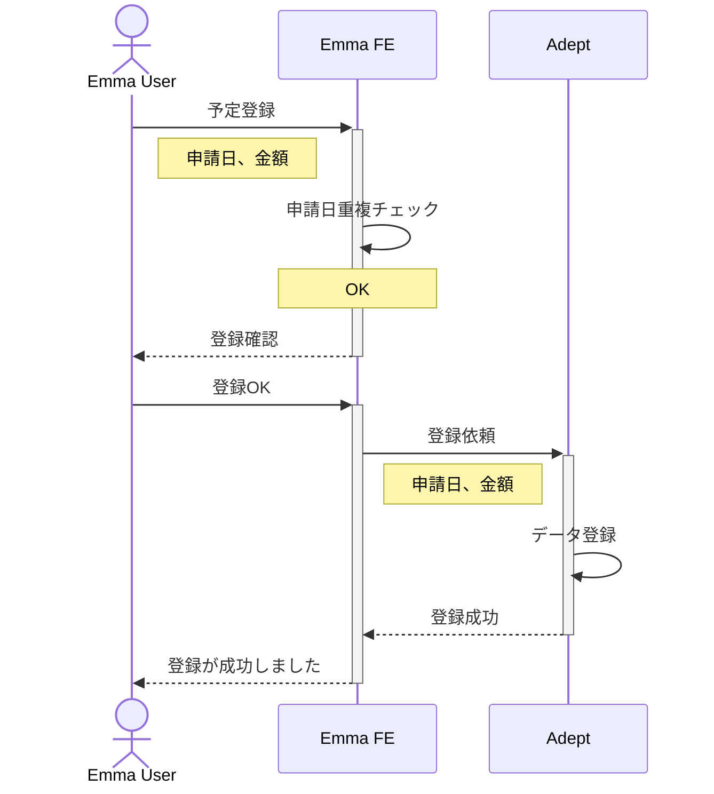

## 予定登録

```mermaid
sequenceDiagram
Actor em as Emma User
Participant fe as Emma FE
Participant ad as Adept
  em->>+fe: 予定登録
  note right of em: 申請日、金額
  fe->>fe: 申請日重複チェック
  note over fe: OK
  fe-->>-em: 登録確認
  em->>+fe: 登録OK
  fe->>+ad: 登録依頼
　note right of fe:申請日、金額
  ad->>ad: データ登録
  ad-->>-fe: 登録成功
  fe-->>-em: 登録が成功しました
```
